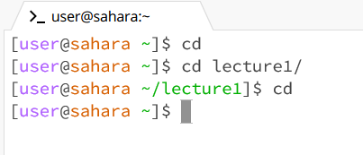
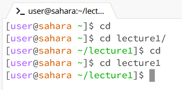
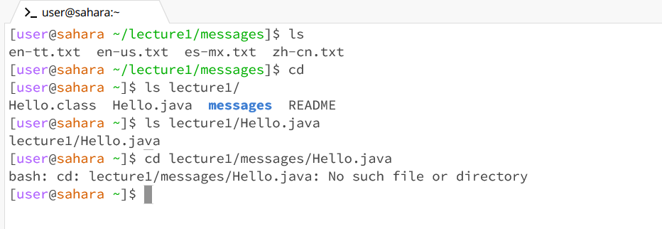
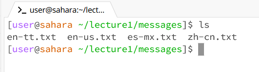
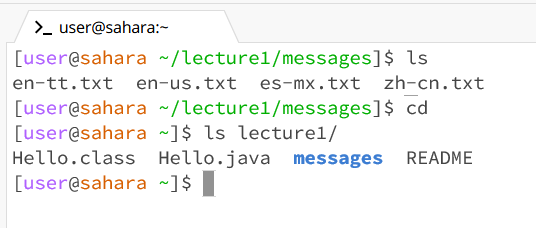
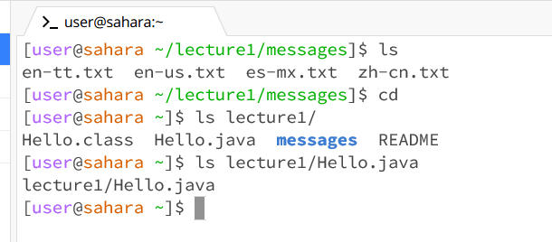
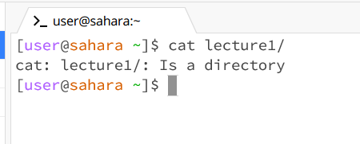
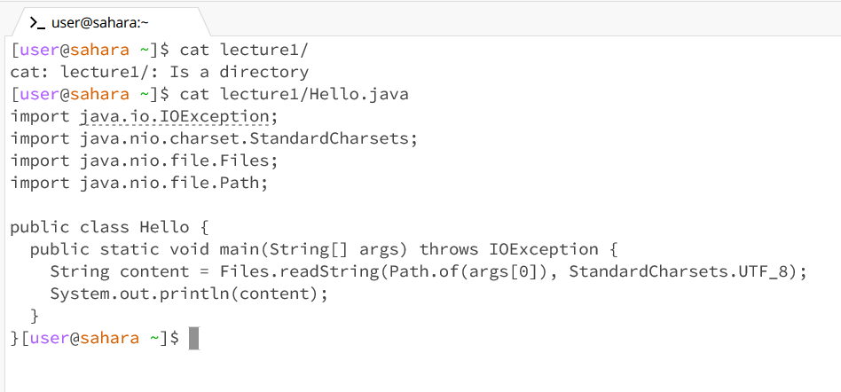

# cd
## cd no arguments

- lecture1
- When cd was run as a command with no arguments, the current working directory that I was in, 'lecture1', was changed to the home directory '~'
- This output is not an error and part of cd functionality

## cd with directory argument

- working directory was '~'
- When running cd with a directory name, the directory was changed to the name that was entered
- This output is not an error

## cd with path to file

- working directory was ~
- When running the command with a path to a file, an error was recieved because you can't cd into a file
- The output was an error and it was an error because you can not cd into a file

# ls
## ls no arguments

- working in ~/lecture1/messages/
- When running this command all files in messages were listed to the terminal screen. The files were all contained in the current working directory
- This was not an error

## ls with directory argument

- working in ~
- When running this command with a directory as an argument, all the files contained in the given argument were shown on the terminal screen
- This was not an error

## ls with path to file

- working in ~
- When running this command with a path to a file, the directory and the file name that was in the argument was printed to the terminal screen
- This was not an error

# cat
## cat no arguments

- working in ~
- When running this command with no arguments, nothing happend except the cursor moving to the next line. It looked like it was waiting for something.
- This was an error and at the same time wasn't. It seems like the terminal halted and was waiting for more input

## cat with directory argument

- working in ~
- When running this command with a directory as an argument, the terminal said that the argument was a directory 
- This was an error as you can not print the contents of a directory to the terminal in the form of text. 

## cat with path to file

- working in ~
- When running this command with a path to a file, the contents of the file were printed to the terminal window. It seems that cat displays the file contents in a text format
- This was not an error

