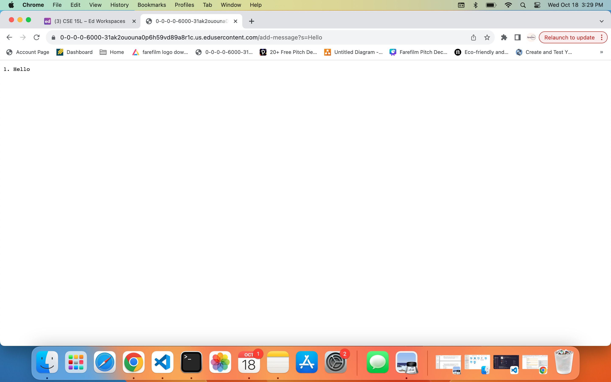
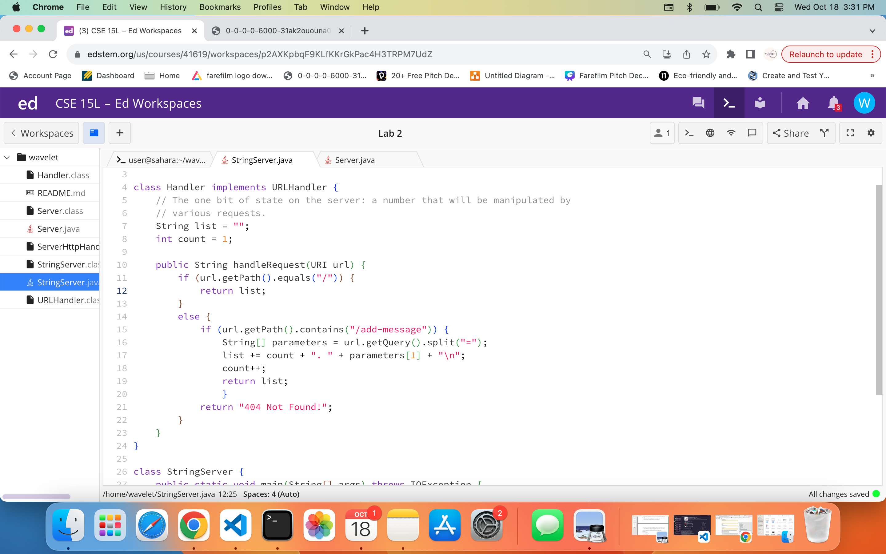

# Part 1
## Test 1

1. The methods that are called in my code are:
   - `String handleRequest(URI url)`
   - `url.getPath().equals("/")`
   - `url.getPath().contains("/add-message")`
   - `url.getQuery().split("=")`
   - `Hello` was added to the `list`
     
2. The relevant arguments are:
   - `URI url`: This is relevant because it creates the URL that we will follow to view the webpage
   - `"/"`: This is the start of the path that the `url` will recieve to make changed to the webpage
   - `"/add-message"`: This is the command the `url` takes in order to add a message to the webpage
   - `"="`: This seperates what we want to do with what we want to add to the webpage

3. The only values that would change in the request, would be anything after `/add-message?s=`. Any input, that is valid, after the `=` will be added to the `list` and shown on the webpage. In this case it was the word "Hello". The other value would be changing the input after `=` to something that was not a `String` such as an `int`. This would kick back a 404 not found message.

## Test 2

1. The methods that are called in my code are:
   - `String handleRequest(URI url)`
   - `url.getPath().equals("/")`
   - `url.getPath().contains("/add-message")`
   - `url.getQuery().split("=")`
   - `Bye` was added to the `list`
  
2. The relevant arguments are:
   - `URI url`: This is relevant because it creates the URL that we will follow to view the webpage
   - `"/"`: This is the start of the path that the `url` will recieve to make changed to the webpage
   - `"/add-message"`: This is the command the `url` takes in order to add a message to the webpage
   - `"="`: This seperates what we want to do with what we want to add to the webpage
  
3. The only values that would change in the request, would be anything after `/add-message?s=`. Any input, that is valid, after the `=` will be added to the `list` and shown on the webpage. In this case it was the word "bye". The other value would be changing the input after `=` to something that was not a `String` such as an `int`. This would kick back a 404 not found message.

## Code

# Part 2
## `ls` private key

## `ls` public key

## Login Without Passphrase

# Part 3
What I learned in week 2 was how to start a web server using the command ssh and some login credentials. I had some idea of how servers worked but didn't have any knowledge on how to get them up and running. From week 3, I learned how to create private and public keys that allow me to login to a remote location without having to use a passphrase. I also learned how to manipulate a webpage using specific paths and code.
