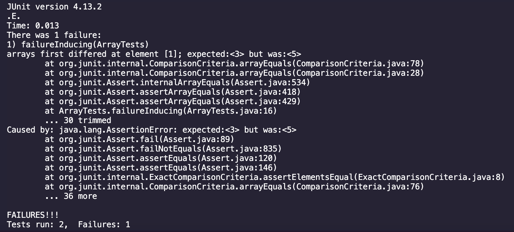

# Part 1
## Failure-Inducing Input
```ruby
@Test 
public void testReverseInPlace() {
    int[] input1 = { 3, 5 };
    ArrayExamples.reverseInPlace(input1);
    assertArrayEquals(new int[]{ 5, 3 }, input1);
}
```

## Non-Failure Inducing Input
```ruby
@Test 
public void testReverseInPlace() {
    int[] input1 = { 3 };
    ArrayExamples.reverseInPlace(input1);
    assertArrayEquals(new int[]{ 3 }, input1);
}
```

## The Symptom


## The Bug
### Before Fix:
```ruby
static void reverseInPlace(int[] arr) {
    for(int i = 0; i < arr.length; i += 1) {
      arr[i] = arr[arr.length - i - 1];
    }
}
```
### After Fix:
```ruby
static void reverseInPlace(int[] arr) {
    int temp = 0;
    for(int i = 0; i < arr.length / 2; i += 1) {
        temp = arr[i];
        arr[i] = arr[arr.length - 1 - i];
        arr[arr.length - 1 - i] = temp;
    }
}
```
### Why this fix works
This fix to the code works because, initially, the code would loop through the array and swap places but once reaching halfway
through the array it would flip the places again. This just created the same array as we started with. The fix cuts the array
in half and only loops through ``array.length / 2``. Then, because this a pass by value, I had to create a new ``temp`` variable 
to store the current value then swap it with ``arr[arr.length - 1 - i]``

# Part 2 (Using ``find``)

*** Material was sourced using ChatGPT ***

### Citation
``“command line options using find” prompt. ChatGPT, 25 September GPT-3.5, OpenAI, 30 October 2023, chat.openai.com.``

## ``find -name``:
### Example 1
This command finds all the ``.txt`` files in ``\technical`` that start with "chapter" then
prints it to the terminal. These can be files in any directory nested under ``\technical``.

Input:
```ruby
find technical -name "chapter*.txt"
```
Output:
```
technical/911report/chapter-13.4.txt
technical/911report/chapter-13.5.txt
technical/911report/chapter-13.1.txt
technical/911report/chapter-13.2.txt
technical/911report/chapter-13.3.txt
technical/911report/chapter-3.txt
technical/911report/chapter-2.txt
technical/911report/chapter-1.txt
technical/911report/chapter-5.txt
technical/911report/chapter-6.txt
technical/911report/chapter-7.txt
technical/911report/chapter-9.txt
technical/911report/chapter-8.txt
technical/911report/chapter-12.txt
technical/911report/chapter-10.txt
technical/911report/chapter-11.txt
```

### Example 2
This command finds all the ``.txt`` files in ``\technical`` that start with "cc" then
prints it to the terminal. These can be files in any directory nested under ``\technical``.

Input:
```ruby
find technical -name "cc*.txt"
```
Output:
```
technical/biomed/cc991.txt
technical/biomed/cc4.txt
technical/biomed/cc367.txt
technical/biomed/cc3.txt
technical/biomed/cc2190.txt
technical/biomed/cc1843.txt
technical/biomed/cc1856.txt
technical/biomed/cc105.txt
technical/biomed/cc1498.txt
technical/biomed/cc1538.txt
technical/biomed/cc1882.txt
technical/biomed/cc300.txt
technical/biomed/cc1529.txt
technical/biomed/cc103.txt
technical/biomed/cc303.txt
technical/biomed/cc1477.txt
technical/biomed/cc1852.txt
technical/biomed/cc713.txt
technical/biomed/cc1476.txt
technical/biomed/cc2172.txt
technical/biomed/cc2358.txt
technical/biomed/cc2167.txt
technical/biomed/cc2171.txt
technical/biomed/cc2160.txt
technical/biomed/cc1044.txt
technical/biomed/cc1497.txt
technical/biomed/cc1495.txt
technical/biomed/cc350.txt
technical/biomed/cc973.txt
technical/biomed/cc1547.txt
technical/biomed/cc343.txt
```

## ``find -type d``:
### Example 1
This command prints all the directories under the ``\technical`` directory given the path of ``technical``. 
The ``d`` at the end of the command specifies ``directory``.

Input:
```ruby
find technical -type d
```
Output:
```
technical
technical/government
technical/government/About_LSC
technical/government/Env_Prot_Agen
technical/government/Alcohol_Problems
technical/government/Gen_Account_Office
technical/government/Post_Rate_Comm
technical/government/Media
technical/plos
technical/biomed
technical/911report
```

### Example 2
This command specified a path directly to the ``media`` directory. By doing this, the only thing that was displayed was the 
absolute path to the directory. i.e. ``technical/government/media``

Input:
```ruby
find technical/government/media -type d
```
Output:
```
technical/government/media
```

## ``find -empty``:
### Example 1
The command looks for an empty directory using ``empty``. Because ``technical`` is a directory that is full,
it ouputs nothing to the terminal.

Input:
```ruby
find technical -empty
```
Output:
Nothing is output

### Example 2
This command does the same thing and looks for an empty directory using ``empty``. Because ``technical/government/media`` 
is a directory that is full, it ouputs nothing to the terminal.

Input:
```ruby
find technical/government/media -empty
```
Output:
There is nothing to ouput 

## ``find -type f``:
### Example 1
This command looks in ``\technical\911report`` for all files and displayed it to the terminal.
If I were to only specift the ``911report`` directory itself, all files nested would be displayed.

Input:
```ruby
find technical/911report -type f
```
Output:
```
technical/911report/chapter-13.4.txt
technical/911report/chapter-13.5.txt
technical/911report/chapter-13.1.txt
technical/911report/chapter-13.2.txt
technical/911report/chapter-13.3.txt
technical/911report/chapter-3.txt
technical/911report/chapter-2.txt
technical/911report/chapter-1.txt
technical/911report/chapter-5.txt
technical/911report/chapter-6.txt
technical/911report/chapter-7.txt
technical/911report/chapter-9.txt
technical/911report/chapter-8.txt
technical/911report/preface.txt
technical/911report/chapter-12.txt
technical/911report/chapter-10.txt
technical/911report/chapter-11.txt
```

### Example 2
This command looks in ``\government\About_LSC`` for all files and displayed it to the terminal.
If I were to only specift the ``government`` directory itself, all files nested would be displayed.

Input:
```ruby
find technical/government/About_LSC -type f
```
Output:
```
technical/government/About_LSC/LegalServCorp_v_VelazquezSyllabus.txt
technical/government/About_LSC/Progress_report.txt
technical/government/About_LSC/Strategic_report.txt
technical/government/About_LSC/Comments_on_semiannual.txt
technical/government/About_LSC/Special_report_to_congress.txt
technical/government/About_LSC/CONFIG_STANDARDS.txt
technical/government/About_LSC/commission_report.txt
technical/government/About_LSC/LegalServCorp_v_VelazquezDissent.txt
technical/government/About_LSC/ONTARIO_LEGAL_AID_SERIES.txt
technical/government/About_LSC/LegalServCorp_v_VelazquezOpinion.txt
technical/government/About_LSC/diversity_priorities.txt
technical/government/About_LSC/reporting_system.txt
technical/government/About_LSC/State_Planning_Report.txt
technical/government/About_LSC/Protocol_Regarding_Access.txt
technical/government/About_LSC/ODonnell_et_al_v_LSCdecision.txt
technical/government/About_LSC/conference_highlights.txt
technical/government/About_LSC/State_Planning_Special_Report.txt
```
