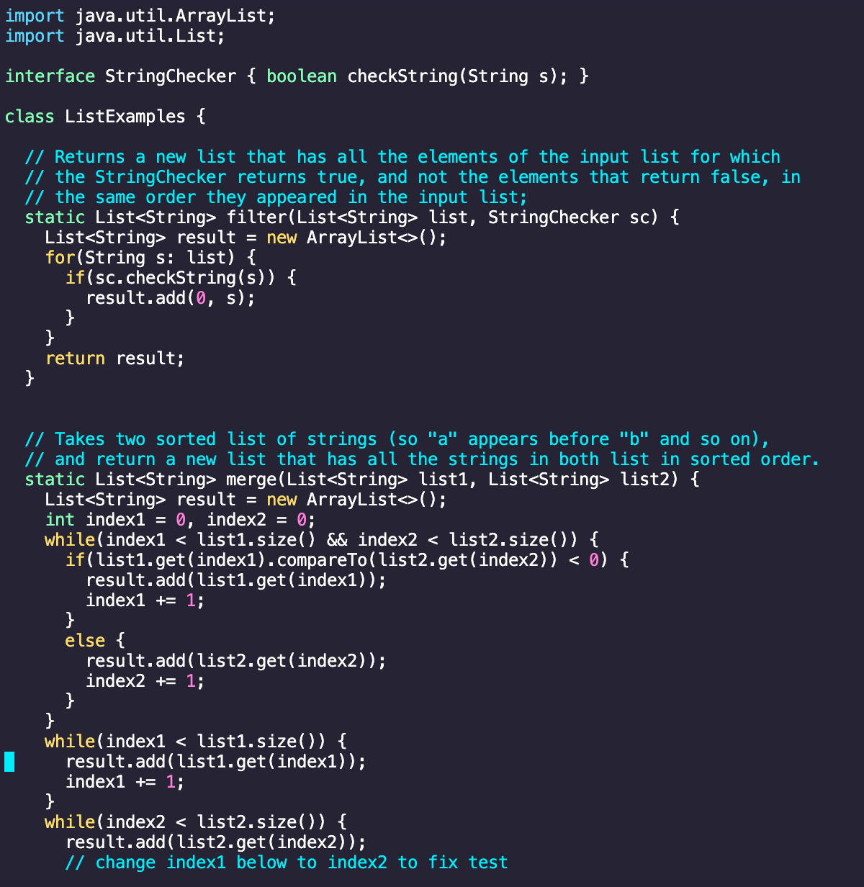
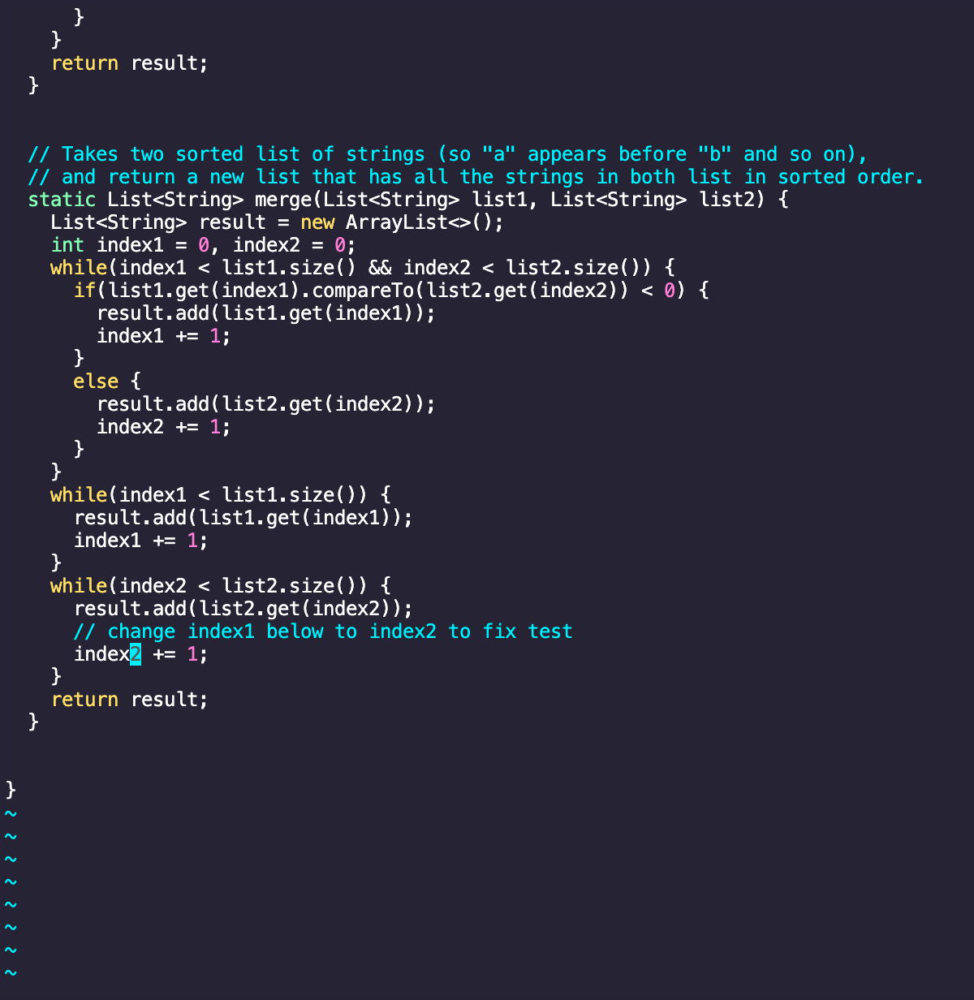
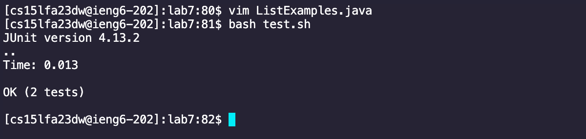
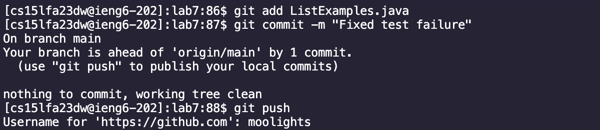

# Lab Report 4

## 1. Logging in:

### Description:
- I used my course specific username to login to the ieng6 server and did not have to use a password
  since I had an SSH key setup.
- Keys Pressed: <csieng6dw@ucsd.edu>,<enter>

## 2. Cloning Fork:

### Description:
- I then cloned the lab 7 repo into my server.
- Keys Pressed: <g,i,t>,<c,l,o,n,e>,<cmd>,<v>,<Enter>

## 3. Running Tests

### Description:
- using the command ``bash test.sh`` I was successfully able to run the tests
  however, there was one failure.
- Keys Pressed: <b,a,s,h>, <t,e,s,t,.,s,h>, <enter>
## 4. Edit Code

### Description:
- To get ``vim`` started I typed the command ``vim ListExamples.java``. After pressing enter, the terminal
  filled with a java file and I was then able to make edits.
- Keys Pressed: <v, i, m>, <shift,l,i,s,t,shift,e,x,a,m,p,l,e,s,.,j,a,v,a>

### Description:
- To make the edits to fix the failing test I did the following:
#### Steps:
1. &rarr; &rarr; &rarr; &rarr; &rarr; &rarr; &rarr; &rarr; &rarr; &rarr; &rarr; (Scroll to the right just above the line that contains the 1 that needs to be changed)
2. &darr; &darr; &darr; &darr; &darr; &darr; (Move down to the line that needs to be changed)
3. `i` (Go into INSERT mode)
4. &rarr; (Move to the right of the character that needs to be deleted)
5. `<backspace>` (Delete the character)
6. `2` (Input 2)
7. `<ESC>` (Go back to normal mode)
8. `<Shift> :` (Enter the colon character)
9. `w` (Write the changes to the java file)
10. `q` (Needed to exit vim)
11. `<Enter>` (Write and exit vim)

After doing these steps, the file was fixed
## 5. Run New Test

### Description:
- After making the edit, I reran the tests and all passed. The issues was with index1 and index2, they needed to be switched in order to properly merge the two lists in the merge2 test.
- Keys Pressed: <b,a,s,h>, <t,e,s,t,.,s,h>, <enter>
## 6. Commit and Push

### Description:
- I ran the command ``git add`` to stage the fixed java file. Then I ran the command ``git commit -m "Fixed failures"`` to
  commit the fixes to the repo. And finally I ran ``git push`` to push the fixed java file to the repo.
- Keys Pressed: <g,i,t>, <a,d,d>, <shift,l,i,s,t,shift,e,x,a,m,p,l,e,s,.,j,a,v,a>, <g,i,t>, <c,o,m,m,i,t>, <-,m>, <shift,",f,i,x,e,d,space,f,a,i,l,u,r,e,s,shift,">

