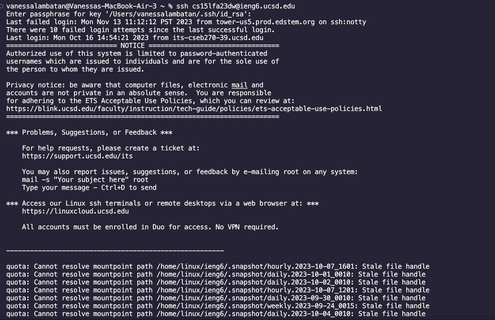
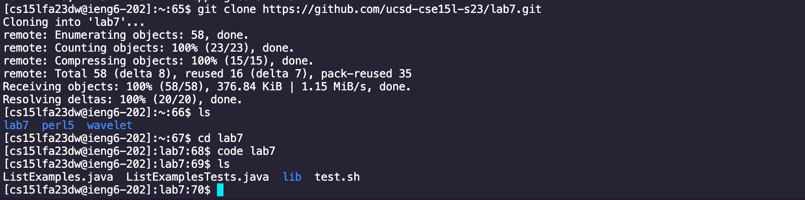
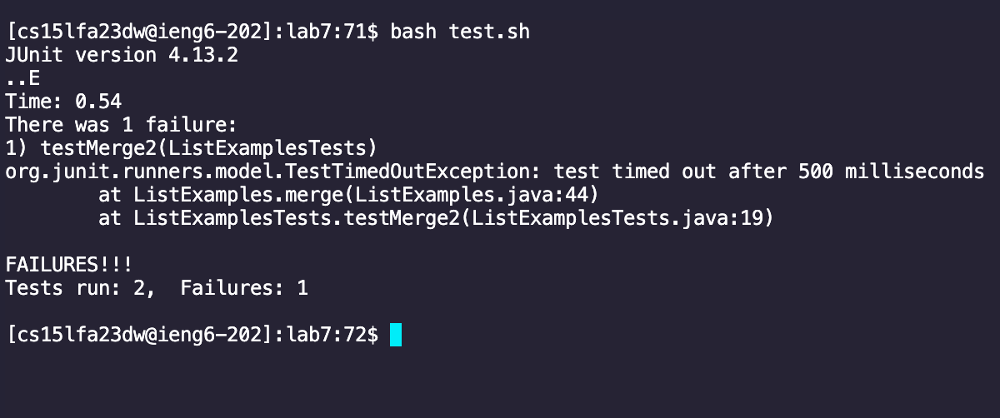

# Lab Report 4

## 1. Logging in:

### Description:
- I used my course specific username to login to the ieng6 server and did not have to use a password
  since I had an SSH key setup

## 2. Cloning Fork:

### Description:
- I then cloned the lab 7 repo into my server

## 3. Running Tests

### Description:
- using the command ``bash test.sh`` I was successfully able to run the tests
  however, there was one failure

## 4. Edit Code

## 5. Run Tests

## 6. Commit and Push

